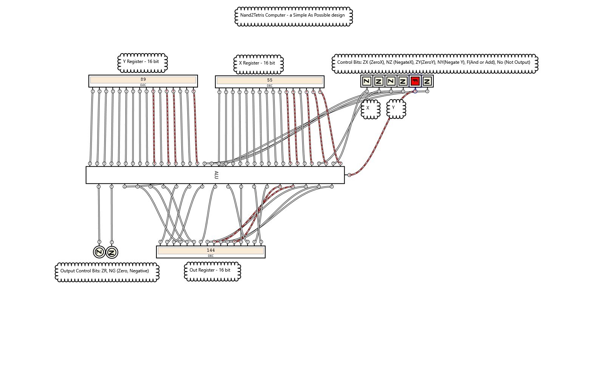

# Logic Gate Simulations for the Nand2Tetris project work  
  
## What is Nand2Tetris?  
Source:  https://www.nand2tetris.org/

Nand2Tetris is a fantastic resouce for anyone who is interested in understanding how computer hardware and software solutions are architected.  The site provides a bottom-up approach to the hardware-software archtiecture relationship. Beyond the website, there is a companion study book (link below) that can be used to augment the learning process. The first several chapters of the book contains challenges of designing the fundamental logic gates of their simple "Hack" computer in a proprietary HDL language and tooling. These files show one solution to those challenges using a different toolset and in a more graphical and yet still interactive approach.
  
Note:  The authors of nand2tetris.org strongly encourage the public not to post solutions to their challenges online. In their words, "allow students to enjoy the thrill of discovery for themselves." I whole-heartedly agree with this sentiment. The internet is already rife with HDL solutions that can be readily cut & pasted for those unscrupulous/unconfident souls that aren't up for the challenge. Anyone wishing to take the low road will find many options out there.  

I hesitated to post this project because of that request but ultimately relented. This data set is for those that have already reasoned out the soluiton and would like a visual representation that has a more graphical feel than is supplied in the nand2tetris software site. The nand2tetris hardware simulator does a great job evaluating the functionality of the solution and even allows breakbpoint debugging in a stepwise fashion.  But showing the code in a 4GL fashion provides a birdseye view of how it all flows.  The HDL is provided here as well since it shows the relationship of the gates to the code. Without it, it may not be as clear to assess.  Sadly I hope this doesn't make me part of the original problem.   

## What is the Logic Gate Simulator? 
Source:  https://www.kolls.net/gatesim/

Logic Gate Simlulator is an open source project providing student engineers an opportunity to model simple logic gates and animate them in realtime.  It is designed as a learning tool and does not provide the sophistication (or complexity) of the CAD solutions that are available for engineers and home electronics enthusiats. What it does do well is provide a quick learning curve and simulator environemnt to watch the behaviors and interactions of logic gates. One can implement and develop complex circuits, add them to a library and build them into more complex solutions. Watching the interaction of these circuits and the data flowing through them helps to visualize exactly what is going on with the design.  

My hope is that these files can be used to provide just another way of understanding the fascintating world of digital computers. As with the original authors intent, nothing beats actually implementing them to really undertand. I too encourage any student to try their hand at designing these gates using their HDL and use my source or PDFs only as a double-check of their final work.  

| ALU.hdl/SAP-1.gcg:  The ALU (Arithmetic Logic Unit) (from nand2tetris.org) - Ruleset
| --- |      
| Computes one of the following functions:  
| x+y, x-y, y-x, 0, 1, -1, x, y, -x, -y, !x, !y,  
| x+1, y+1, x-1, y-1, x&y, x|y on two 16-bit inputs,   
| according to 6 input bits denoted zx,nx,zy,ny,f,no.  
| In addition, the ALU computes two 1-bit outputs:   
| if the ALU output == 0, zr is set to 1; otherwise zr is set to 0;   
| if the ALU output < 0, ng is set to 1; otherwise ng is set to 0.   
    
  
|  zx  |  nx   |  zy   |  ny   |  f   |  no   |  out=  |  
| ---- | ----- | ----- | ----- | ---- | ----- | -----: |  
|  1   |   0   |   1   |   0   |  1   |   0   |   0    |  
|  1   |   1   |   1   |   1   |  1   |   1   |   1    |  
|  1   |   1   |   1   |   0   |  1   |   0   |  -1    |  
|  0   |   0   |   1   |   1   |  0   |   0   |   x    |  
|  1   |   1   |   0   |   0   |  0   |   0   |   y    |  
|  0   |   0   |   1   |   1   |  0   |   1   |  !x    |   
|  1   |   1   |   0   |   0   |  0   |   1   |  !y    |  
|  0   |   0   |   1   |   1   |  1   |   1   |  -x    |  
|  1   |   1   |   0   |   0   |  1   |   1   |  -y    |  
|  0   |   1   |   1   |   1   |  1   |   1   |  x+1   |   
|  1   |   1   |   0   |   1   |  1   |   1   |  y+1   |  
|  0   |   0   |   1   |   1   |  1   |   0   |  x-1   |  
|  1   |   1   |   0   |   0   |  1   |   0   |  y-1   |  
|  0   |   0   |   0   |   0   |  1   |   0   |  x+y   |   
|  0   |   1   |   0   |   0   |  1   |   1   |  x-y   |  
|  0   |   0   |   0   |   1   |  1   |   1   |  y-x   |  
|  0   |   0   |   0   |   0   |  0   |   0   |  x&y   |  
|  0   |   1   |   0   |   1   |  0   |   1   |  x|y   |  
  

  
## Getting Started  
To get started, copy the source files to a clean directory  
Install nand2tetris per the instructions on their website (links below) 
Install Logic Gate Simulator per the instructions on their website (links below)  
Open any .hdl in the nand2tetris Hardware Simulator tool  
Open any .gcg file in the Logic Gate Simulator tool
Open 02/SAP-1.gcg in the LGS tool to simulate the ALU.  Use the table above to drive the funcitonality   
Each component has a corresponding image file in the documentation directory    

## Prerequisites
Windows compatible desktop  
Nand to Tetris Hardware Simulator  
Logic Gate Simulator Tool  
    
## Developer notes
LogicGate-Simulator-Diagrams/SAP-1.gcg:  main entry point for an interactive view of the ALU for the Logic Gate Simulator.
HDL/02/ALU.hdl:  main entry point for the functioning ALU using the nand2tetris Hardware simulator  
Development: developed using Visual Studio Code, but any text editor would work, including notepad.  
GitHub:  ubiquitous code version control management   
  
## Future Enhancements
Current solution only uses combinatorial gate,  future enhancements include adding sequence gates (counters, clocks, etc)
  
## Built With
Logic Gate Simulator 1.4.0 - Logic Gate Simulator (https://www.kolls.net/gatesim/)   
Hardware Simulator 2.6.0 -nand2tetris.org software suite  (https://www.nand2tetris.org/software)
   
## Author
Michael Galarneau - Five0ffour  
November, 2019  
  
## Acknowledgements
Credits to "From Nand to Tetris" site.  Follow their formula and walk through the exercises to get the most value.   
Companion Book:  [Elements of Computing Systems](https://www.amazon.com/Elements-Computing-Systems-Building-Principles/dp/0262640686/ref=sr_1_1?crid=1B8YVVXDAAMPL&keywords=elements+of+computing+systems&qid=1572968833&sprefix=Elemnts+of+Computing+%2Caps%2C144&sr=8-1)  
Inspiration for this project: [Teach Yourself Computer Science](https://teachyourselfcs.com/#architecture)  
  
## Deployed Site
None - desktop client applications
